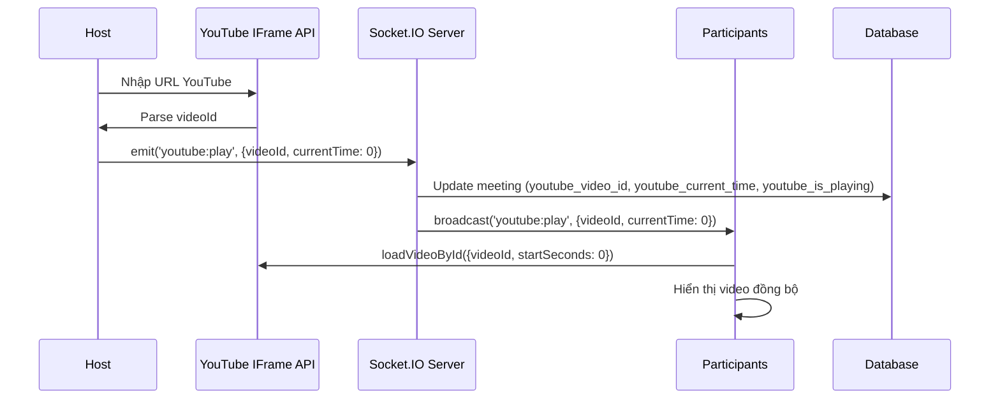
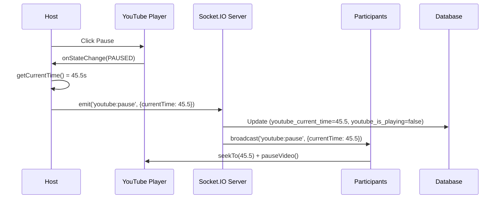
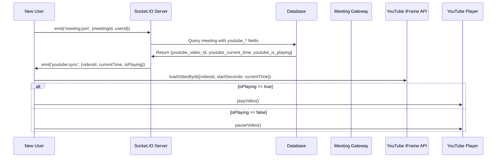

# 📺 Tính năng Watch YouTube Together - Hướng dẫn Chi tiết

## 🎯 Tổng quan

Tính năng **Watch YouTube Together** cho phép nhiều người dùng trong cùng một phòng meeting xem video YouTube đồng bộ với nhau. Host điều khiển video (play/pause/seek), và tất cả thành viên sẽ thấy video được đồng bộ real-time.

## 🏗️ Kiến trúc Kỹ thuật

### 1. **Frontend Components**

#### **YouTubePlayer Component** (`youtube-player.tsx`)
- **Chức năng chính:**
  - Nhúng YouTube IFrame API
  - Xử lý control events (play/pause/seek)
  - Đồng bộ video state qua Socket.IO
  - Hiển thị UI cho host và participants

- **Props:**
  ```typescript
  interface YouTubePlayerProps {
    socket: Socket | null;           // Socket.IO connection
    isHost: boolean;                 // Người dùng có phải host không?
    initialVideoId?: string;         // Video ID ban đầu từ database
    initialCurrentTime?: number;     // Timestamp ban đầu
    initialIsPlaying?: boolean;      // Trạng thái phát
  }
  ```

#### **MeetingRoom Component** (`meeting-room.tsx`)
- **Tích hợp YouTube Player:**
  - Toggle giữa Video Grid và YouTube Player
  - Truyền socket connection và host status
  - Hiển thị controls

### 2. **Backend Gateway** (`meetings.gateway.ts`)

#### **Socket.IO Events:**

**Client → Server:**
```typescript
// Phát video tại timestamp X (kèm videoId nếu video mới)
socket.emit('youtube:play', { 
  videoId?: string,    // YouTube video ID (optional, chỉ cần khi đổi video)
  currentTime: number  // Timestamp hiện tại (giây)
});

// Dừng video tại timestamp Y
socket.emit('youtube:pause', { 
  currentTime: number 
});

// Tua đến timestamp Z
socket.emit('youtube:seek', { 
  currentTime: number 
});
```

**Server → Clients (broadcast):**
```typescript
// Server gửi đến TẤT CẢ users trong room
socket.on('youtube:play', (data) => {
  videoId: string;
  currentTime: number;
  userId: string;  // Host user ID
});

socket.on('youtube:pause', (data) => {
  currentTime: number;
  userId: string;
});

socket.on('youtube:seek', (data) => {
  currentTime: number;
  userId: string;
});

// Sync state cho user mới join
socket.on('youtube:sync', (data) => {
  videoId: string;
  currentTime: number;
  isPlaying: boolean;
});
```

### 3. **Database Schema** (`meeting.entity.ts`)

```typescript
@Entity('meetings')
export class Meeting {
  // YouTube fields
  @Column({ type: 'varchar', length: 255, nullable: true })
  youtube_video_id: string;

  @Column({ type: 'float', default: 0 })
  youtube_current_time: number;

  @Column({ type: 'boolean', default: false })
  youtube_is_playing: boolean;
  
  // ... other fields
}
```

## 🔄 Luồng Hoạt động Chi tiết

### **Scenario 1: Host chọn video mới**



**Code Flow:**
1. Host nhập URL: `https://www.youtube.com/watch?v=dQw4w9WgXcQ`
2. Frontend parse `videoId`: `dQw4w9WgXcQ`
3. Frontend gọi `socket.emit('youtube:play', { videoId: 'dQw4w9WgXcQ', currentTime: 0 })`
4. Backend nhận event → Lưu vào database → Broadcast đến all clients
5. Tất cả clients nhận event → Load video → Seek to 0 → Play

### **Scenario 2: Host pause video**



### **Scenario 3: User mới join phòng**



**Code (Backend - meetings.gateway.ts):**
```typescript
@SubscribeMessage('meeting:join')
async handleJoinMeeting(@ConnectedSocket() client: SocketWithUser, ...) {
  // ... join logic
  
  // Send YouTube sync state
  const meeting = participant.meeting;
  if (meeting.youtube_video_id) {
    client.emit('youtube:sync', {
      videoId: meeting.youtube_video_id,
      currentTime: meeting.youtube_current_time,
      isPlaying: meeting.youtube_is_playing,
    });
  }
}
```

## 🎨 UI/UX

### **Host View:**
- ✅ Button "Search YouTube Video" khi chưa có video
- ✅ Input để paste URL YouTube hoặc video ID
- ✅ Button "X" để clear video
- ✅ YouTube Player với controls (play/pause/seek/volume)

### **Participant View:**
- ✅ Text "Waiting for host to start YouTube video..." khi chưa có video
- ✅ YouTube Player **không có controls** (chỉ xem)
- ✅ Video tự động sync với Host

### **Toggle between Video Grid & YouTube:**
```tsx
<Button onClick={() => setShowVideoGrid(false)}>
  <Play className="w-4 h-4 mr-1" />
  YouTube
</Button>
<Button onClick={() => setShowVideoGrid(true)}>
  <Video className="w-4 h-4 mr-1" />
  Video Grid
</Button>
```

## 🔧 Cấu hình & Setup

### **Không cần YouTube API Key!**
YouTube IFrame API là **miễn phí** và không yêu cầu API key cho embedding videos.

### **CORS Configuration (Backend):**
```typescript
@WebSocketGateway({
  cors: {
    origin: ['http://localhost:3000', 'http://localhost:3001'],
    credentials: true,
  },
})
```

### **Load YouTube IFrame API (Frontend):**
```typescript
useEffect(() => {
  const tag = document.createElement("script");
  tag.src = "https://www.youtube.com/iframe_api";
  document.head.appendChild(tag);
  
  window.onYouTubeIframeAPIReady = () => {
    console.log("✅ YouTube IFrame API ready");
    initPlayer();
  };
}, []);
```

## 🧪 Testing Scenarios

### **Test 1: Host chọn video**
1. ✅ Host join meeting
2. ✅ Host click "Search YouTube Video"
3. ✅ Host paste URL: `https://www.youtube.com/watch?v=jNQXAC9IVRw`
4. ✅ Video hiển thị và phát
5. ✅ **Expected:** Participant thấy video đồng bộ

### **Test 2: Host pause/play**
1. ✅ Host pause video tại 30s
2. ✅ **Expected:** Participant video pause tại 30s
3. ✅ Host play video
4. ✅ **Expected:** Participant video play tiếp

### **Test 3: User mới join**
1. ✅ Host đang phát video tại 1:15 (75s)
2. ✅ User mới join meeting
3. ✅ **Expected:** User mới thấy video tại 75s và đang phát

### **Test 4: Seek video**
1. ✅ Host kéo seekbar đến 2:30 (150s)
2. ✅ **Expected:** Participant video jump đến 150s

### **Test 5: Network latency**
1. ✅ Host pause video
2. ✅ Network delay 500ms
3. ✅ **Expected:** Participant vẫn sync đúng timestamp

## 🐛 Troubleshooting

### **Vấn đề: Video không sync**
**Nguyên nhân:** Socket.IO không kết nối
**Giải pháp:**
```typescript
// Check socket connection
console.log('Socket connected:', socket?.connected);

// Check meeting:joined event
socket.on('meeting:joined', (data) => {
  console.log('✅ Joined meeting successfully');
});
```

### **Vấn đề: Participant không thấy video**
**Nguyên nhân:** YouTube IFrame API chưa load
**Giải pháp:**
```typescript
// Check API ready
if (!window.YT || !window.YT.Player) {
  console.error('❌ YouTube API not loaded');
}
```

### **Vấn đề: Video không play auto**
**Nguyên nhân:** Browser autoplay policy (yêu cầu user interaction)
**Giải pháp:** User phải click vào page trước khi video có thể autoplay

## 📊 Performance Optimization

### **1. Debounce seek events:**
```typescript
const debouncedSeek = useMemo(
  () => debounce((time: number) => {
    socket.emit('youtube:seek', { currentTime: time });
  }, 500),
  [socket]
);
```

### **2. Cache video state trong Redis (Backend):**
```typescript
// Thay vì query DB mỗi lần sync
await redis.set(`meeting:${meetingId}:youtube`, JSON.stringify({
  videoId,
  currentTime,
  isPlaying
}), 'EX', 3600);
```

### **3. Giảm log spam:**
```typescript
// Chỉ log khi state thay đổi thực sự
if (prevState.isPlaying !== isPlaying) {
  console.log('🎬 State changed:', isPlaying ? 'PLAYING' : 'PAUSED');
}
```

## 🚀 Tính năng Mở rộng (Future)

### **1. YouTube Queue/Playlist:**
```typescript
interface YouTubeQueue {
  videos: string[];          // Array of videoIds
  currentIndex: number;
  autoAdvance: boolean;      // Tự động chuyển video tiếp theo
}
```

### **2. Watch History:**
```typescript
@Entity('meeting_watch_history')
export class MeetingWatchHistory {
  @Column()
  meeting_id: string;
  
  @Column()
  video_id: string;
  
  @Column()
  watched_duration: number;  // Tổng thời gian xem (giây)
  
  @Column()
  completed: boolean;        // Xem hết video chưa?
}
```

### **3. Reactions on video:**
```typescript
socket.emit('youtube:reaction', {
  timestamp: 45.5,           // Timestamp video
  emoji: '😂',               // Emoji reaction
});
```

### **4. Synchronized subtitle/comments:**
- Show comments from YouTube at specific timestamps
- Overlay chat messages on video timeline

## 📝 Code Examples

### **Parse YouTube URL:**
```typescript
const extractVideoId = (url: string): string | null => {
  const patterns = [
    /(?:youtube\.com\/watch\?v=|youtu\.be\/|youtube\.com\/embed\/)([^&\n?#]+)/,
    /^([a-zA-Z0-9_-]{11})$/,  // Direct video ID
  ];

  for (const pattern of patterns) {
    const match = url.match(pattern);
    if (match) return match[1];
  }
  return null;
};
```

### **Handle player state:**
```typescript
const onPlayerStateChange = (event: any) => {
  const state = event.data;
  const currentTime = event.target.getCurrentTime();
  
  if (state === window.YT.PlayerState.PLAYING) {
    socket.emit('youtube:play', { videoId, currentTime });
  } else if (state === window.YT.PlayerState.PAUSED) {
    socket.emit('youtube:pause', { currentTime });
  } else if (state === window.YT.PlayerState.ENDED) {
    // Auto-advance to next video in queue
    socket.emit('youtube:video-ended', { videoId });
  }
};
```

## ✅ Checklist Hoàn thành

- [x] Frontend: YouTube Player component với IFrame API
- [x] Frontend: Socket.IO events (play/pause/seek)
- [x] Frontend: UI cho Host và Participants
- [x] Frontend: Parse YouTube URLs
- [x] Backend: Socket.IO handlers (youtube:play, youtube:pause, youtube:seek)
- [x] Backend: Database fields (youtube_video_id, youtube_current_time, youtube_is_playing)
- [x] Backend: Sync state cho user mới join
- [x] Fix: Non-host users không thấy player
- [x] Documentation: Hướng dẫn chi tiết

## 🎉 Kết luận

Tính năng **Watch YouTube Together** đã hoàn chỉnh và sẵn sàng sử dụng! 

**Cách sử dụng:**
1. Host tạo meeting và start
2. Participants join meeting
3. Host click "YouTube" button (bottom controls)
4. Host paste YouTube URL
5. Tất cả mọi người xem video đồng bộ!

**Không cần API key, không cần thêm dependencies!** 🚀
